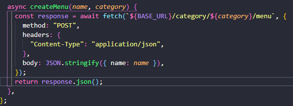
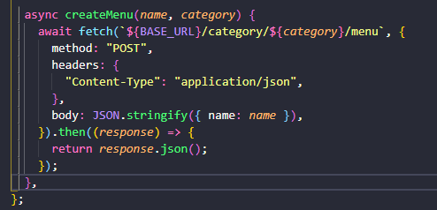
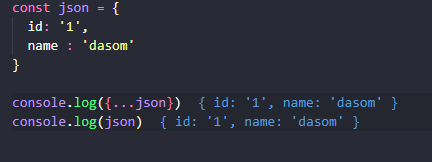

# 못풀었던 에러 모음집

## 1. fetch이후에 this.state 값이 반영이 안됨 (setState()까지 들어가는것을 확인했으나 globaly하게 반영이 안됨)

App.js 에서 해당 컴포넌트 호출

```
      new ProductDetailPage({ $target, productId }).render();
```

ProductDetailPage.js

```
	import { request } from "../utils/api.js";
import { ProductDetail } from "./ProductDetail.js";

export default function ProductDetailPage({ $target, productId }) {
  this.state = {
    productId,
    product: null,
  };

  const $page = document.createElement("div");
  $page.className = "ProductDetailPage";
  $page.innerHTML = `<h1>${this.state.name}상품 정보</h1>`;
  this.$target = $target;

  this.setState = (newState) => {
    this.state = newState;
    this.render();
    // this.state 잘 들어갔음
  };

  this.fetchProductsDetail = async () => {
    const product = await request(`products/${this.state.productId}`);
    this.setState({ ...this.state, product });
    // this.productDetail.setState(product);
  };

  this.render = () => {
    if (!this.state.product) {
      $target.innerHTML = "Loading...";
    } else {
      $target.innerHTML = "";
      $target.appendChild($page);
      this.productDetail = new ProductDetail({
        $target: $page,
        initialState: this.state,
      });
    }
  };

  this.fetchProductsDetail();
  console.log(this.state); // product가 null이 나옴
  this.productDetail = new ProductDetail({
    $target: $page,
    initialState: this.state,
  });
}


```

---

## 2. case1은 되는데 case2는 왜 안되는지..?!

### case1



### case2



---

## for문 안에서의 setTimeout or setInterval

테스트용으로 돌려보려고 했는데 자꾸 12345 이런식으로 한거번에 찍혔다. <br>
결국 클로저를 이용해서 해결은 했는데 왜 클로저를 쓰면 되는지 잘 모르겠다. <br>
클로저의 개념을 안다고 사용했는데 정확히 알지 못하는 것 같고 이부분은 다시 공부해야겠다.

```
for(let i = 0; i < 5; i ++) {
  ((x) =>{
     setTimeout(() => {
       console.log(x);
     }, 1000*x); // 특히 이부분
  })(i);
}

```

왜 안되니.. Promise fullfilled...

```

  this.fetchProducts = () => {
    const cartItem = getItem("products_cart");
    return cartItem.map(async (item) => {
      const products = await request(`/products/${item.productId}`);
      // console.log(products);
      const options = await products.productOptions.find(
        (option) => option.id === item.optionId
      );
      // console.log(options);
      return {
        name: options.name,
        price: options.price,
        imageUrl: products.imageUrl,
      };
    });
  };
  // quantity, name, price, img
  this.render = () => {
    this.$target.appendChild($page);

    const result = this.fetchProducts()
    console.log(result);
```

## 이 두개가 뭐가 다른지 모르겠다.


